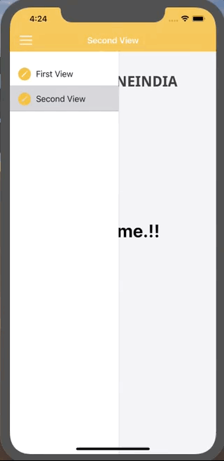

# iOS - Custom Drawer Menu

This demo project provides customizable Drawer Menu with dynamic Menu that can be used as a reusable component in your application. 

## Table of contents
- [iOS Support](#iOS-support)
- [Demo](#demo)
- [Features](#features)
- [Getting started](#getting-started)
- [Usage](#usage)
- [Methods](#methods)
- [Want to Contribute?](#want-to-contribute)
- [Need Help / Support?](#need-help)
- [Collection of Components](#collection-of-Components)
- [Changelog](#changelog)
- [License](#license)
- [Keywords](#Keywords)

## iOS Support

Version - iOS 12, iOS 13

We have tested our program in above versions, however you can use it in other versions as well

## Demo

------

## Features

* Left Side / Right Side drawer menu can be presented. 
* Customizable Slider Menu as per requirements.

## Getting started

* Download this sample project and import SideMenu folder files in your Swift-iOS App. 
* Update Slider Menu ViewController UI based on your requirements. 

## Usage

Setup process is described below to integrate in project.

## Configure DrawerMenu in your rootview controller by following below method steps

### Methods

Step 1. Create you view controlelr for present side menu UI (MyMenuTableViewController())

Step 2. Add navigation for show one view to other view controller
       
    // Create a table view controller for side menu
    let tableViewController = MyMenuTableViewController()
       
    // Create side menu & set position
    sideMenu = WLISideMenu(sourceView: view, menuViewController: tableViewController, menuPosition:.left)
       
    // Set a delegate
    sideMenu?.delegate = self
      
    // Configure side menu
    sideMenu?.menuWidth = 180.0
       
    // Show navigation bar above side menu  
    view.bringSubviewToFront(navigationBar)
  

Step 3. set delegte if you want call back otherwise skip it

If you want call back then set in your present sidemenu  delegate in ViewController                 
       
    self.sideMenuController()?.sideMenu?.delegate = self

Step 4. Set delegate for get call back sidemenu current status 

    func sideMenuWillOpen() 
    
    func sideMenuWillClose()
    
    func sideMenuDidClose()
    
    func sideMenuDidOpen() 
    
    func sideMenuShouldOpenSideMenu() -> Bool

Step 5. Open / Close side menu just call this function in your projects 

    toggleSideMenuView()

------

## Want to Contribute?

- Created something awesome, made this code better, added some functionality, or whatever (this is the hardest part).
- [Fork it](http://help.github.com/forking/).
- Create new branch to contribute your changes.
- Commit all your changes to your branch.
- Submit a [pull request](http://help.github.com/pull-requests/).

------

## Need Help? 
We also provide a free, basic support for all users who want to use this SideMenu demo in project. In case you want to customize this SideMenu input to suit your development needs, then feel free to contact our [iOS
developers](https://www.weblineindia.com/hire-ios-app-developers.html).

 ------
 
## Collection of Components
 We have built many other components and free resources for software development in various programming languages. Kindly click here to view our [Free Resources for Software Development.](https://www.weblineindia.com/communities.html)
 
------

## Changelog
Detailed changes for each release are documented in [CHANGELOG](./CHANGELOG).

## License

 [MIT](LICENSE)

 [mit]: https://github.com/weblineindia/iOS-Custom-Drawer-Menu/blob/master/LICENSE

## Keywords
iOS Drawer Menu, Slider Menu, Swift Slider Menu, Drawer Menu, Side Menu , Weblineindia
